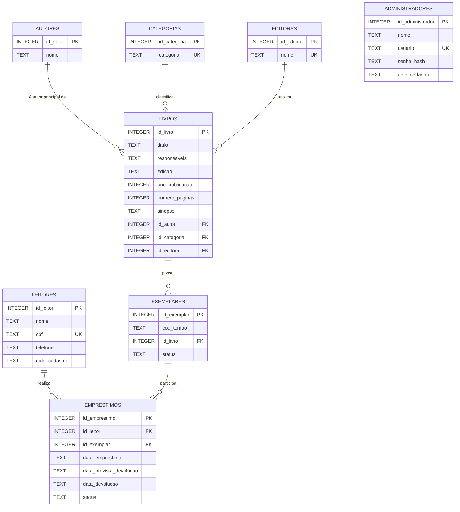

# book-book

Sistema acadêmico de gerenciamento de biblioteca (livros, exemplares, leitores
e empréstimos), com back-end em Python (arquitetura em camadas: controllers,
services, repositories) e SQLite, e front-end em HTML/CSS/JavaScript puro.

> Integrantes, RAs e objetivo detalhado do trabalho: **pendente de
> preenchimento**.

## Tecnologias

- **Back-end:** Python 3.10+ (biblioteca padrão — `http.server`, `sqlite3`)
- **Banco de dados:** SQLite
- **Front-end:** HTML, CSS e JavaScript (sem framework)

## Estrutura Completa

```text
book-book/
├── README.md
├── .gitignore
├── requirements.txt
│
├── app/
│   ├── main.py
│   │
│   ├── config/
│   │   └── database.py
│   │
│   ├── controllers/
│   │   ├── auth_controller.py
│   │   ├── autor_controller.py
│   │   ├── categoria_controller.py
│   │   ├── editora_controller.py
│   │   ├── livro_controller.py
│   │   ├── exemplar_controller.py
│   │   ├── leitor_controller.py
│   │   └── emprestimo_controller.py
│   │
│   ├── repositories/
│   │   ├── administrador_repository.py
│   │   ├── autor_repository.py
│   │   ├── categoria_repository.py
│   │   ├── editora_repository.py
│   │   ├── livro_repository.py
│   │   ├── exemplar_repository.py
│   │   ├── leitor_repository.py
│   │   ├── emprestimo_repository.py
│   │   └── auditoria_repository.py
│   │
│   ├── services/
│   │   ├── auth_service.py
│   │   ├── livro_service.py
│   │   ├── leitor_service.py
│   │   ├── exemplar_service.py
│   │   ├── emprestimo_service.py
│   │   └── auditoria_service.py
│   │
│   └── utils/
│       ├── datas.py
│       ├── respostas.py
│       ├── seguranca.py
│       └── validadores.py
│
├── database/
│   ├── book_book.db
│   ├── ddl.sql
│   ├── dml_inicial.sql
│   ├── consultas_testes.sql
│   └── README.md
│
├── frontend/
│   ├── index.html
│   ├── login.html
│   ├── livros.html
│   ├── cadastro-livro.html
│   ├── informacoes-livro.html
│   ├── exemplares.html
│   ├── emprestar-livro.html
│   ├── devolver-livro.html
│   ├── leitores.html
│   ├── cadastro-leitor.html
│   │
│   ├── components/
│   │   ├── navbar.html
│   │   ├── sidebar.html
│   │   ├── modal-confirmacao.html
│   │   └── mensagens.html
│   │
│   └── assets/
│       ├── css/
│       │   ├── global.css
│       │   ├── login.css
│       │   ├── livros.css
│       │   ├── leitores.css
│       │   ├── exemplares.css
│       │   └── emprestimos.css
│       │
│       ├── js/
│       │   ├── api.js
│       │   ├── auth.js
│       │   ├── livros.js
│       │   ├── cadastro-livro.js
│       │   ├── informacoes-livro.js
│       │   ├── leitores.js
│       │   ├── cadastro-leitor.js
│       │   ├── exemplares.js
│       │   ├── emprestimos.js
│       │   └── validacoes.js
│       │
│       └── img/
│           ├── logo-book-book.png
│           └── icone-livro.png
│
├── docs/
│   ├── mer.png
│   ├── der.png
│   ├── regras-negocio.md
│   ├── manual-instalacao.md
│   ├── planejamento-projeto.pdf
│   │
│   ├── evidencias/
│   │   ├── 01-login.png
│   │   ├── 02-listagem-livros.png
│   │   ├── 03-cadastro-livro.png
│   │   ├── 04-edicao-livro.png
│   │   ├── 05-informacoes-livro.png
│   │   ├── 06-adicionar-exemplar.png
│   │   ├── 07-excluir-exemplar.png
│   │   ├── 08-cadastro-leitor.png
│   │   ├── 09-edicao-leitor.png
│   │   ├── 10-emprestimo.png
│   │   ├── 11-devolucao.png
│   │   ├── 12-auditoria.png
│   │   └── 13-persistencia-sqlite.png
│   │
│   └── apresentacao/
│       └── book-book-apresentacao.pdf
│
└── tests/
    ├── test_database.py
    ├── test_autenticacao.py
    ├── test_livros.py
    ├── test_leitores.py
    ├── test_exemplares.py
    ├── test_emprestimos.py
    └── dados_teste.sql
```

> Arquivos binários ainda não produzidos (logo, ícones, diagramas MER/DER,
> capturas de tela de evidências e PDFs de planejamento/apresentação) têm
> suas pastas versionadas via `.gitkeep` e serão adicionados conforme forem
> gerados.

## Função de cada área

| Pasta ou arquivo | Finalidade |
|---|---|
| `README.md` | Documento principal: integrantes, RAs, objetivo, tecnologias, instalação, DER, regras de negócio e prints |
| `.gitignore` | Impede envio de arquivos desnecessários, como `__pycache__`, ambientes virtuais e arquivos temporários |
| `requirements.txt` | Informa dependências; inicialmente contém apenas a versão mínima do Python, pois `sqlite3` já é nativo |
| `app/` | Todo o código Python do back-end |
| `app/main.py` | Inicia o servidor local e direciona requisições do front-end |
| `app/config/database.py` | Centraliza a conexão e configuração do SQLite |
| `app/controllers/` | Recebe as requisições, chama serviços e devolve respostas para o front-end |
| `app/repositories/` | Contém os comandos SQL diretos: `INSERT`, `SELECT`, `UPDATE` e `DELETE` |
| `app/services/` | Concentra regras de negócio, como prazo de sete dias, limite de três empréstimos e atualização de status |
| `app/utils/` | Funções reutilizáveis para datas, validações, segurança de senha e mensagens de resposta |
| `database/` | Banco SQLite e scripts SQL usados para criar e popular o banco |
| `database/ddl.sql` | Criação de tabelas, PKs, FKs, `CHECK`, `UNIQUE` e demais restrições |
| `database/dml_inicial.sql` | Dados iniciais para demonstrar o sistema (administrador, categorias, autores, editoras, livros e exemplares) |
| `database/consultas_testes.sql` | Consultas SQL usadas para testar e demonstrar registros, empréstimos, devoluções e auditoria |
| `frontend/` | Páginas HTML do sistema e seus recursos estáticos |
| `frontend/components/` | Partes reutilizáveis da interface, como menu, barra lateral, modal e mensagens |
| `frontend/assets/css/` | Arquivos de estilização separados por tela ou funcionalidade |
| `frontend/assets/js/` | Scripts JavaScript de integração com o back-end, formulários, buscas e validações |
| `docs/` | Documentação técnica e acadêmica exigida pelo trabalho |
| `docs/evidencias/` | Capturas de tela que comprovam interface, CRUD e persistência dos dados |
| `tests/` | Testes manuais ou automatizados das funções mais importantes |

## Modelo de dados (DER)



O schema SQL (`database/ddl.sql`) ainda será implementado a partir deste
modelo nas próximas etapas.

## Estado atual

Esta etapa entrega a **estrutura completa do projeto já com o back-end
conectado ao front-end**, mas sem regras de negócio implementadas:

- `app/main.py` sobe um servidor HTTP (biblioteca padrão do Python) que serve
  os arquivos estáticos de `frontend/` e roteia `/api/*` para os
  controllers correspondentes.
- A rota `GET /api/status` já responde de verdade e é consumida por
  `frontend/assets/js/api.js` — a página `index.html` exibe o resultado
  dessa checagem ao carregar, confirmando que front-end e back-end estão
  conectados.
- As demais rotas (`/api/autores`, `/api/livros`, `/api/leitores`, etc.)
  já estão roteadas até os controllers correspondentes, mas retornam
  `501 Não implementado` — a lógica de negócio de cada uma será adicionada
  nas próximas etapas.

## Instalação e execução

Veja [`docs/manual-instalacao.md`](docs/manual-instalacao.md).

```bash
python -m app.main
```

Depois acesse `http://127.0.0.1:8000`.
