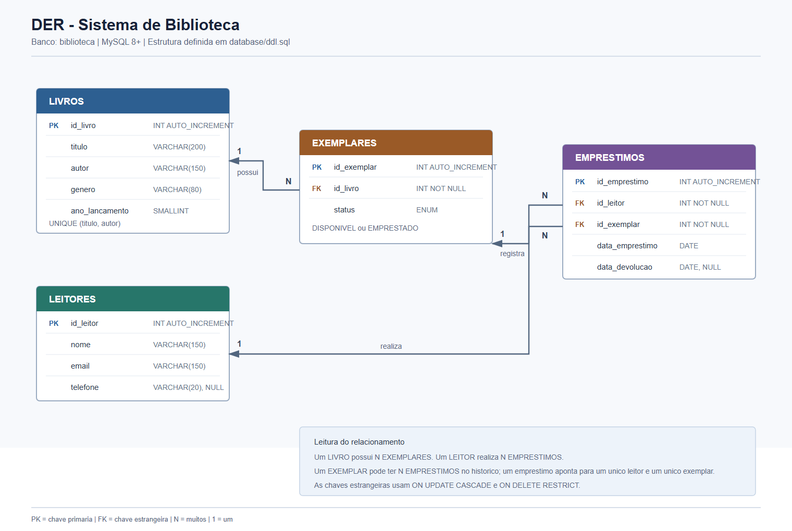

# Book Book

Sistema de gerenciamento de biblioteca desenvolvido para fins academicos. A aplicacao permite organizar livros, leitores, exemplares fisicos e emprestimos em uma interface web simples.

O projeto usa Python no back-end, MySQL para persistencia e HTML, CSS e JavaScript puros no front-end. Nao ha framework ou etapa de build: depois da configuracao, basta iniciar o servidor e abrir o navegador.

## O que o sistema faz

- Cadastra, lista, pesquisa, edita e exclui livros.
- Cadastra, lista, pesquisa, edita e exclui leitores.
- Cria exemplares fisicos vinculados a um livro.
- Registra emprestimos somente para exemplares disponiveis.
- Registra devolucoes e atualiza o status do exemplar automaticamente.
- Mantem o historico: registros ligados a emprestimos nao podem ser excluidos.

## Tecnologias e requisitos

| Item | Versao ou uso |
| --- | --- |
| Python | 3.10 ou superior |
| MySQL | 8 ou superior |
| Python packages | `pydantic` e `mysql-connector-python` |
| Front-end | HTML, CSS e JavaScript puros |
| Navegador | Chrome, Edge, Firefox ou equivalente atualizado |

## Comecando do zero

Os passos abaixo servem tanto para um clone do Git quanto para uma pasta baixada em ZIP. Os comandos de ambiente virtual sao para PowerShell; em outro terminal, use o equivalente da sua plataforma.

### 1. Abra a pasta do projeto

```powershell
cd caminho\para\TrabalhoBC
```

### 2. Crie e ative o ambiente virtual

```powershell
python -m venv .venv
.\.venv\Scripts\Activate.ps1
```

Se o PowerShell bloquear a ativacao, execute este comando apenas na janela atual e tente de novo:

```powershell
Set-ExecutionPolicy -Scope Process -ExecutionPolicy Bypass
```

### 3. Instale as dependencias

```powershell
python -m pip install -r requirements.txt
```

### 4. Crie a configuracao local

O arquivo com as credenciais nao faz parte do repositorio. Crie sua copia a partir do exemplo:

```powershell
Copy-Item config\config.example.py config\config.py
```

Abra `config/config.py` e informe o usuario e a senha do seu MySQL:

```python
DB_HOST = "localhost"
DB_PORT = 3306
DB_USER = "root"
DB_PASSWORD = "sua_senha"
DB_NAME = "biblioteca"
USAR_BANCO_MEMORIA = False
```

Nunca envie `config/config.py` para o Git. Ele ja esta listado no `.gitignore`.

### 5. Crie e popule o banco

Com o MySQL em execucao, rode os scripts na ordem abaixo. No PowerShell, a forma mais direta e usar o cliente MySQL instalado:

```powershell
Get-Content database\ddl.sql -Raw | mysql -u root -p
Get-Content database\dml_inicial.sql -Raw | mysql -u root -p
```

O primeiro comando cria o banco `biblioteca` e as quatro tabelas. O segundo inclui os dados de demonstracao.

> Atenção: `database/ddl.sql` remove e recria as tabelas do projeto. Use-o somente em ambiente de desenvolvimento ou depois de fazer backup dos dados que deseja preservar.

Se `mysql` nao for reconhecido, abra o MySQL Workbench, conecte-se ao servidor, abra cada arquivo SQL e execute-o na mesma ordem. Tambem e possivel adicionar a pasta `bin` do MySQL ao `PATH`.

### 6. Inicie a aplicacao

```powershell
python -m app.main
```

Abra [http://127.0.0.1:8000](http://127.0.0.1:8000) no navegador. Pare o servidor com `Ctrl+C` no terminal.

## Dados iniciais

Depois de executar o DDL e o DML, o banco comeca com:

| Registro | Quantidade |
| --- | ---: |
| Livros | 10 |
| Leitores | 5 |
| Exemplares disponiveis | 4 |
| Emprestimos | 0 |

Os exemplares iniciais pertencem aos primeiros livros cadastrados. Isso permite testar o fluxo de emprestimo logo depois de abrir o sistema.

## Como usar

| Tela | Endereco | Uso principal |
| --- | --- | --- |
| Inicio | `/` | Apresentacao e acesso rapido ao acervo |
| Livros | `/cadastro.html` | Gerencia o catalogo de obras |
| Leitores | `/leitores.html` | Gerencia as pessoas cadastradas |
| Exemplares | `/exemplares.html` | Gerencia as copias fisicas de cada livro |
| Emprestimos | `/emprestimos.html` | Registra retiradas e devolucoes |

Fluxo recomendado para uma demonstracao:

1. Cadastre um leitor, caso queira usar um novo.
2. Cadastre um livro ou escolha um livro existente.
3. Cadastre pelo menos um exemplar para esse livro.
4. Na tela de emprestimos, selecione um leitor e um exemplar disponivel.
5. Registre a devolucao para tornar o exemplar disponivel novamente.

## Regras principais

- Um livro e identificado de forma unica pela combinacao de titulo e autor.
- Um leitor nao pode repetir o e-mail de outro leitor.
- Um exemplar sempre pertence a um livro existente.
- O status do exemplar nao e alterado manualmente: ele vira `EMPRESTADO` ao registrar um emprestimo e volta para `DISPONIVEL` na devolucao.
- Um livro com exemplares nao pode ser removido.
- Um leitor com historico de emprestimos nao pode ser removido.
- Um exemplar emprestado, ou que ja tenha historico, nao pode ser removido.
- O emprestimo e a troca de status do exemplar acontecem na mesma transacao do MySQL.

## API HTTP

O proprio servidor Python entrega o front-end e a API. Por isso, nao ha configuracao de CORS nem URL externa no JavaScript.

| Metodo | Rota | Descricao |
| --- | --- | --- |
| `GET` | `/api/livros` | Lista livros; aceita `busca`, `genero`, `periodo` e `ordem` |
| `GET` | `/api/livros/filtros` | Lista generos disponiveis para o filtro |
| `POST` | `/api/livros` | Cadastra livro |
| `PUT` | `/api/livros/{id}` | Edita livro |
| `DELETE` | `/api/livros/{id}` | Exclui livro sem exemplares |
| `GET` | `/api/leitores` | Lista leitores; aceita `busca` |
| `POST` | `/api/leitores` | Cadastra leitor |
| `PUT` | `/api/leitores/{id}` | Edita leitor |
| `DELETE` | `/api/leitores/{id}` | Exclui leitor sem emprestimos |
| `GET` | `/api/exemplares` | Lista exemplares; aceita `busca` e `status` |
| `POST` | `/api/exemplares` | Cadastra exemplar disponivel |
| `PUT` | `/api/exemplares/{id}` | Edita exemplar disponivel |
| `DELETE` | `/api/exemplares/{id}` | Exclui exemplar sem historico |
| `GET` | `/api/emprestimos` | Lista emprestimos; aceita `busca` e `situacao` |
| `POST` | `/api/emprestimos` | Registra emprestimo |
| `PUT` | `/api/emprestimos/{id}/devolucao` | Registra devolucao |

As respostas usam JSON. A API devolve `201` em cadastros, `400` em dados invalidos, `404` para recursos ou rotas inexistentes e `503` quando nao consegue acessar o MySQL.

Exemplo de cadastro de livro:

```json
{
  "titulo": "Ensaio sobre a Cegueira",
  "autor": "Jose Saramago",
  "genero": "Romance",
  "ano_lancamento": 1995,
  "resumo": "Uma cidade enfrenta uma epidemia de cegueira branca."
}
```

## Modelo de dados



A versao vetorial editavel do diagrama esta em `docs/der.svg`.

- Um livro pode possuir varios exemplares.
- Um leitor pode possuir varios emprestimos ao longo do tempo.
- Um exemplar pode aparecer em varios emprestimos ao longo de sua vida, mas apenas um pode estar ativo por vez.

As chaves estrangeiras e restricoes completas estao em `database/ddl.sql`.

## Arquitetura

```text
Navegador
    |
    v
Servidor HTTP (app/core/servidor.py)
    |
    v
Services: regras de negocio e validacao
    |
    v
Repositories: consultas e comandos SQL
    |
    v
Database: conexao e transacoes MySQL
```

Cada camada tem uma responsabilidade simples:

| Pasta ou arquivo | Responsabilidade |
| --- | --- |
| `app/main.py` | Monta as dependencias e inicia o servidor |
| `app/core/servidor.py` | Entrega arquivos estaticos e responde a API |
| `app/core/database.py` | Abre conexoes, executa comandos e controla transacoes |
| `app/models/` | Define e valida os dados com Pydantic |
| `app/services/` | Aplica regras de negocio |
| `app/repositories/` | Contem o SQL de cada tabela |
| `frontend/` | Paginas, estilos e JavaScript do navegador |
| `database/ddl.sql` | Estrutura do banco |
| `database/dml_inicial.sql` | Dados de demonstracao |
| `config/config.example.py` | Modelo de configuracao local sem senha |
| `tests/` | Testes automatizados das regras e transacoes |

## Estrutura do repositorio

```text
app/                    back-end Python
config/                 configuracao local e exemplo seguro
database/               scripts DDL e DML do MySQL
docs/                   DER e documentacao complementar
frontend/               interface web e recursos estaticos
tests/                  testes automatizados
requirements.txt        dependencias Python
```

## Executando os testes

Os testes usam repositorios em memoria e conexoes falsas. Portanto, eles nao alteram o MySQL nem dependem do banco estar ativo.

```powershell
.\.venv\Scripts\python.exe -m unittest discover -s tests
```

## Modo em memoria

Para explorar a interface sem configurar o MySQL, altere temporariamente esta opcao em `config/config.py`:

```python
USAR_BANCO_MEMORIA = True
```

Nesse modo, o sistema carrega dados de exemplo e tudo e perdido ao reiniciar o servidor. Para usar os dados persistentes criados pelos scripts SQL, mantenha `USAR_BANCO_MEMORIA = False`.

## Problemas comuns

| Situacao | O que verificar |
| --- | --- |
| `Unknown database 'biblioteca'` | Execute primeiro `database/ddl.sql`. |
| `Access denied` | Revise `DB_USER` e `DB_PASSWORD` em `config/config.py`. |
| `mysql` nao e reconhecido | Use o MySQL Workbench ou adicione a pasta `bin` do MySQL ao `PATH`. |
| Erro ao ativar `.venv` | Use `Set-ExecutionPolicy -Scope Process -ExecutionPolicy Bypass`. |
| A pagina nao carrega dados | Inicie com `python -m app.main` e abra `http://127.0.0.1:8000`, nao o HTML diretamente. |
| Dados desaparecem ao reiniciar | Confirme que `USAR_BANCO_MEMORIA` esta `False`. |
| Erro de chave estrangeira | Cadastre primeiro o livro, leitor ou exemplar relacionado. |

## Integrantes

Preencha aqui os nomes, RAs e demais informacoes solicitadas para a entrega academica.
